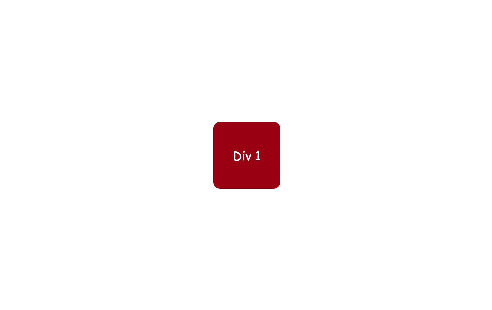
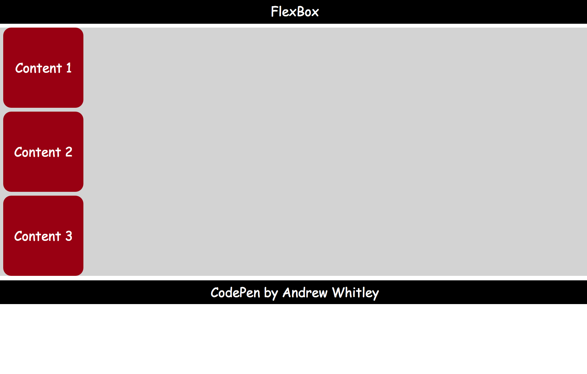

# Flexbox

## Learning Objectives

- Give an example of a problem solved by Flexbox.
- Contrast flex containers and flex items.
- Given a desktop-first webpage, make it look presentable on mobile devices (and vice-versa) with as little CSS as possible.
- Explain what is meant by the "Holy Grail Layout".

## Framing

HTML was created as a document-oriented language. CSS emerged as a way to use language to precisely define stylistic features in a way that wouldn't clutter the semantic content or worse destroy the semantic value all together. CSS pursued the related goal of normalizing styling across browsers. In many ways it achieves this goal well; yet it remains one of the most frustrating parts of web development.

[Obligatory Peter Griffin CSS GIF](http://2.bp.blogspot.com/-41v6n3Vaf5s/UeRN_XJ0keI/AAAAAAAAN2Y/YxIHhddGiaw/s1600/css.gif).

It's difficult to establish new CSS standards. The [CSS Working Group](https://en.wikipedia.org/wiki/CSS_Working_Group) has a hard time agreeing on anything and the problem of cross-browser consistency perpetuates this problem.

Alignment has traditionally been one of the key contributors to this aggravation. In the last decade, the importance of alignment has sky rocketed.

> Why might this be?

Fortunately, Flexbox, a layout mode introduced with CSS3, and at this point is widely implemented. There is a slight learning curve but it supplants whole families of hacks or libraries necessary to achieve intricate layout in an intuitive and maintainable way.

## Problem 1: Vertical Alignment (15 minutes / 0:15)

Let's start out by talking about a problem that anybody who has written CSS has likely dealt with:

**I have a `div`. I would like to center it vertically and horizontally on my page.** The end result should look something like this...



Example on [Codepen](http://codepen.io/awhitley1233/pen/ygJzJW)

#### You Tell Me: What Should I Try?

```html
<html>
  <body>
    <div> Div 1 </div>
  </body>
</html>
```

```CSS
body {
  min-height: 100vh;
  margin: 0 auto;
}

div {
  width: 100px;
  height: 100px;
  background: #990012;
  color: #FFFFFF;
  border-radius: 10px;
  font: 14pt Comic Sans MS;
  text-align: center;
  line-height: 100px;
}
```

<details>
  <summary><strong>These might work...</strong></summary>

  > **Padding**: The simplest approach would be to set equal padding on the top and bottom of the container (body) element. We would need to know the exact height of the element and container in order to get this exactly right. This can also get tedious when there is more than one element in a container.
  >
  > **Margin**: Similarly, we could add some margin to the element we are trying to center. The same issues remain.
  >
  > **Absolute Positioning**: You could use properties like `top` and `left` to position an element in the center. This, however, removes it from the document flow.

</details>

<details>
  <summary><strong>These could work in other scenarios...</strong></summary>

  > **`line-height`**: When vertically centering a single line of text, you can set the line-height to that of the whole container.
  >
  > **`vertical-align`**: Used to align words within a line of text (e.g., superscript, subscript).

</details>

The tough part is that how to vertically center a element depends on its context meaning that an element has to look to its parent and then align itself; siblings start to make this very difficult. Depending on your situation, one or more of the above techniques could work. [Here's an enlightening post on the matter](https://css-tricks.com/centering-in-the-unknown/).

### Flexbox to the Rescue

```CSS
body {
  min-height: 100vh;
  margin: 0 auto;
  display: flex;
  justify-content: center;
  align-items: center;
}
```

View solution [here](http://codepen.io/awhitley1233/pen/EZyvMY)

## How It Works (10 minutes / 0:10)


When you declare `display: flex` in a CSS rule, whatever is targeted by that rule becomes a **flex container**.

The flexbox approach differs from the methods described above in that the arrangement of elements is managed by the **parent** container. The child of a **flex container** is called a **flex item**. We can change the way flex items display by setting item-specific properties that will come later in the lesson.

After the `display` property, the most important flexbox property to understand is `flex-direction`.
It is very important to remember that the `flex-direction` orients **flex container's main-axis**.
The main access can set to run vertically or horizontally depending on the value of `flex-direction`.
All other flex-related properties are defined in terms of the main axis.

First, use `flex-direction` to indicate whether you want the flex items in the container to "read" left-to-right (`row`), right-to-left (`row-reverse`), top-to-bottom (`column`), **or** bottom-to-top (`column-reverse`).

| flex-direction | main-axis start |
|----------------|-----------------|
| row (default)  | left            |
| column         | top             |
| row-reverse    | right           |
| column-reverse | bottom          |

The `justify-content` property aligns content relative to the **main axis**. Possible values are: `flex-start` (default), `flex-end`, `center`, `space-between`, and `space-around`.

> What do you think each does; does the flex-direction affect this?

The `align-items` property is similar to `justify-content` but aligns relative to the **cross-axis**. There are similar options here: `flex-start`, `flex-end`, `center`, `stretch` (default), and `baseline` (items are aligned by their baselines / where the text is).

By default, a **flex container** will arrange its children in a single row or column. The `flex-wrap` property can modify this with the values `nowrap` (default), `wrap`, and `wrap-reverse`.

When text is wrapping, `align-content` controls how the rows or columns are arranged relative to the cross-axis: `flex-start`, `flex-end`, `stretch` (default), `center`, `space-between`, and `space-around`.

### In Summary...

| Property | What's It Do? | Examples |
|----------|---------------|----------|
| **display**  |               | `flex`   |
| **[flex-direction](https://developer.mozilla.org/en-US/docs/Web/CSS/flex-direction)** | Sets the directional flow of flex items | `row`, `column` |
| **[justify-content](https://developer.mozilla.org/en-US/docs/Web/CSS/justify-content)** | Align along main axis | `center`, `space-between` |
| **[align-items](https://developer.mozilla.org/en-US/docs/Web/CSS/align-items)** | Align along cross-axis | `flex-start`, `center` |

> That's a lot of CSS properties! Don't worry, you're not expected to memorize all of them. Being a developer is less about knowing everything off the top of your head and more about knowing best practices and where to find more info [Here's a great resource](https://css-tricks.com/snippets/css/a-guide-to-flexbox/).

## Problem 2: Make the Footer Stick (10 minutes / 0:35)

I want my footer to lie along the bottom of my page. Once I've accomplished that, I want to evenly distribute the content boxes horizontally inside of the `<main>` element.



[Example on CodePen](http://codepen.io/awhitley1233/pen/ygJzqy)

#### You Tell Me: What Should I Try?

```html
<html>
  <header>
    FlexBox
  </header>
  <main>
    <section>Content 1</section>
    <section>Content 2</section>
    <section>Content 3</section>
  </main>
  <footer>
    CodePen by Andrew Whitley
  </footer>
</html>
```

```CSS
body {
  min-height: 100vh;
  margin: 0 auto;
  font: 12pt Comic Sans MS;
}

header, footer {
  width: 100%;
  height: 30px;
  background: #000000;
  color: #FFFFFF;
  text-align: center;
  line-height: 30px;
}

main {
  background: #D3D3D3;
}

section {
  width: 100px;
  background: #990012;
  color: #FFFFFF;
  border-radius: 10px;
  margin: 5px;
  text-align: center;
  line-height: 100px;
}
```

Making the footer lie against the bottom of the screen is pretty easy: just use absolute or fixed positioning. However, using absolute or fixed positioning means everything else on the page ignores my footer. The text of `<main>` could easily run under the footer. We want the text to "push" the footer to the end of the page.

### Flexbox to the Rescue

```CSS
body {
  min-height: 100vh;
  margin: 0 auto;
  font: 12pt Comic Sans MS;
  display: flex;
  flex-direction: column;
  justify-content: space-between;
}
```

<details>
  <summary><strong>How is main axis of the `body` oriented here? What about the cross-axis?</strong></summary>

  > Main: vertically, Cross: horizontally

</details>


Now let's horizontally distribute the `<section>` elements containing the page's content inside of the `<main>`. What element should we style?

```CSS
main {
  background: #D3D3D3;
  display: flex;
  justify-content: space-around;
}
```

[Solution on CodePen](http://codepen.io/awhitley1233/pen/PWzOPg)

## You Do: More Flexbox Properties (25 minutes / 1:00)

Time for you to research some more Flexbox properties. You will be split into groups and assigned one of the following flex properties...

- `flex-wrap`
- `flex-grow`
- `order`
- `align-content`

Your task is to...
* Come up with [ELI5 ("Explain Like I'm 5")](https://www.reddit.com/r/explainlikeimfive) definition for the property.
* List the different values this property can take.
* Create [a Codepen](http://codepen.io) demonstrating the property's usage, then post it in the discussion Slack channel.
* If possible, practice using some of the flex properties we covered in the previous section.

> You will need to (create a Codepen account)[https://codepen.io/accounts/signup] in order to save your pen and share the link.

If you finish early, try exploring some of the [other flexbox properties](https://css-tricks.com/snippets/css/a-guide-to-flexbox/) not assigned in this exercise.

#### Some Helpful Resources

- [CSS Tricks' Guide to Flexbox](https://css-tricks.com/snippets/css/a-guide-to-flexbox/)
- [A Visual Guide to CSS Flexbox Properties](https://scotch.io/tutorials/a-visual-guide-to-css3-flexbox-properties)
- [Solved by Flexbox](http://philipwalton.github.io/solved-by-flexbox/)
- [Flexplorer](http://bennettfeely.com/flexplorer/)

### Recap

<details>
  <summary><strong><code>align-content</code></strong></summary>

  > How multiple rows or columns are spaced along the cross-axis. Takes the same properties as justify-content.
  >
  > [Example](http://codepen.io/asim-coder/pen/WrMNWR)

</details>

<details>
  <summary><strong><code>flex-grow</code></strong></summary>

  > If the flex container is too big for all the flex items, flex-grow specifies the relative proportion a particular flex item will occupy
  >
  > [Example](https://codepen.io/raphaelgoetter/pen/yyMOOp)

</details>

<details>
  <summary><strong><code>flex-wrap</code></strong></summary>

  > Defines flex item behavior if they expand beyond a single line.
  >
  > [Example](https://codepen.io/raphaelgoetter/pen/yyMOOp)

</details>

<details>
  <summary><strong><code>order</code></strong></summary>

  > Specifies the order in which you want flex items to appear along the main access. The default is 0. Negative numbers are allowed.

</details>

<details>
  <summary><strong><code>flex-basis</code></strong></summary>

  > Specifies how big the flex items "want" to be, or the initial size of a flex item
  >
  > [Example](https://codepen.io/raphaelgoetter/pen/yyMOOp)

</details>

## Break (10 minutes / 1:10)

## The Holy Grail Layout (5 minutes / 1:15)


This is something you know well, even if you don't recognize the term. It describes a webpage with a header bar, a footer bar, and three columns along the middle: a wide "main" column, a navigation column on the left, and an advertisement, site map, or extra info column along the right.

Obviously, this layout won't work on tiny screens, unless you really like super-skinny columns. It's common to stack things on top of each other for mobile views to make one single column.

Before flexbox, this involved a lot of pushing and shoving with dimensions and positioning. You would essentially have to write two completely separate stylesheets: one for mobile, and one for desktop.

With flexbox, just change the `flex-direction` for smaller screen sizes, make any size / order adjustments on the sections of the page, and you're pretty much done!

```css
@media screen and (max-width: 600px){
  main {
    flex-direction: column;
  }

  section {
    order: 1;
  }
}
```

> A layout so holy, [it has its own Wikipedia article](https://en.wikipedia.org/wiki/Holy_Grail_(web_design)).

[Example](http://codepen.io/awhitley1233/pen/XpKzqV)

## You Do: [Hyrule Potion Shop](https://github.com/ga-dc/hyrule_potion_shop) (10 minutes / 1:25)

## Break (10 minutes / 1:35)

## You Do (Finish for HW): [Airbnb](https://github.com/ga-wdi-exercises/css-airbnb) (30 minutes / 2:05)

## Closing / Questions (5 minutes / 2:10)
---

## Resources

* [The Ultimate Flexbox Cheatsheet](http://www.sketchingwithcss.com/samplechapter/cheatsheet.html)
* [CSS Tricks Guide to Flexbox](https://css-tricks.com/snippets/css/a-guide-to-flexbox/)
* [A Visual Guide to CSS3 Flexbox Properties](https://scotch.io/tutorials/a-visual-guide-to-css3-flexbox-properties)
* [Solved by Flexbox](http://philipwalton.github.io/solved-by-flexbox/)
* [Flexplorer](http://bennettfeely.com/flexplorer/)
* [Holy Grail Layout - Solved By Flexbox](https://philipwalton.github.io/solved-by-flexbox/demos/holy-grail/)
* [Flexbox Froggy](http://flexboxfroggy.com/)

Screencasts
- [Part 1](http://youtu.be/wBlBTO7mqoI)
- [Part 2](http://youtu.be/_I58MXDnBEs)

## Further Reading

* [The CSS `grid` Module](https://css-tricks.com/snippets/css/complete-guide-grid/)
